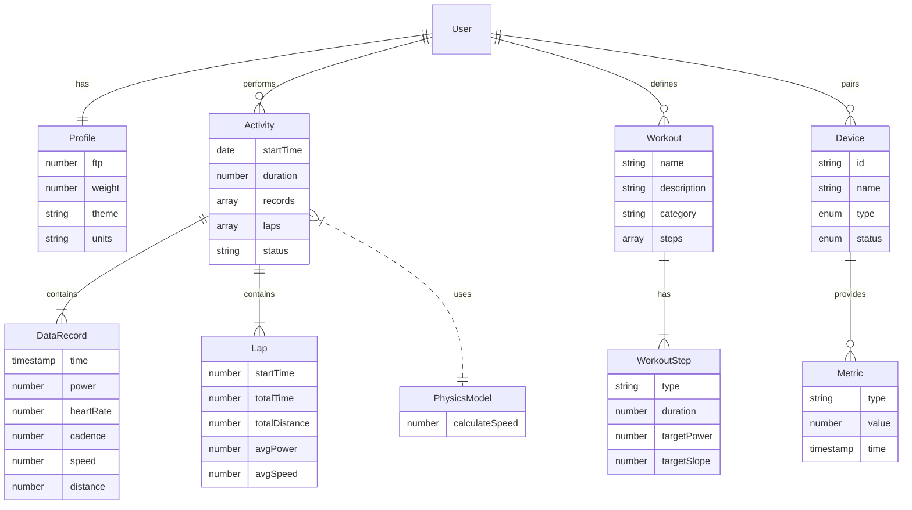

# Entity Relationship

The following diagram illustrates the logical relationships between the core entities in the application.

## Entity Descriptions

### User / Profile
Represents the cyclist using the application. Critical attributes like **FTP** (Functional Threshold Power) and **Weight** are used in physics calculations and workout intensity scaling.

### Activity
A single session of riding. It can be a free ride or a structured workout. It strictly records time-series data (`records`) and aggregate data (`laps`).

### Workout
A structured plan consisting of intervals. 
*   **ZWO Format**: The system parses XML definitions to build internal structures.
*   **Steps**: Individual blocks (Warmup, SteadyState, Intervals) that define targets.

### Device
Hardware sensors connected via ANT+ or BLE.
*   **Controllable**: A Smart Trainer that accepts resistance/slope commands.
*   **Sensors**: Power Meters, HR Monitors, Cadence sensors.

### Metric
Real-time data points flowing through the `xf` event bus. 
*   Examples: `power`, `cadence`, `heartRate`, `smo2` (Muscle Oxygen).
